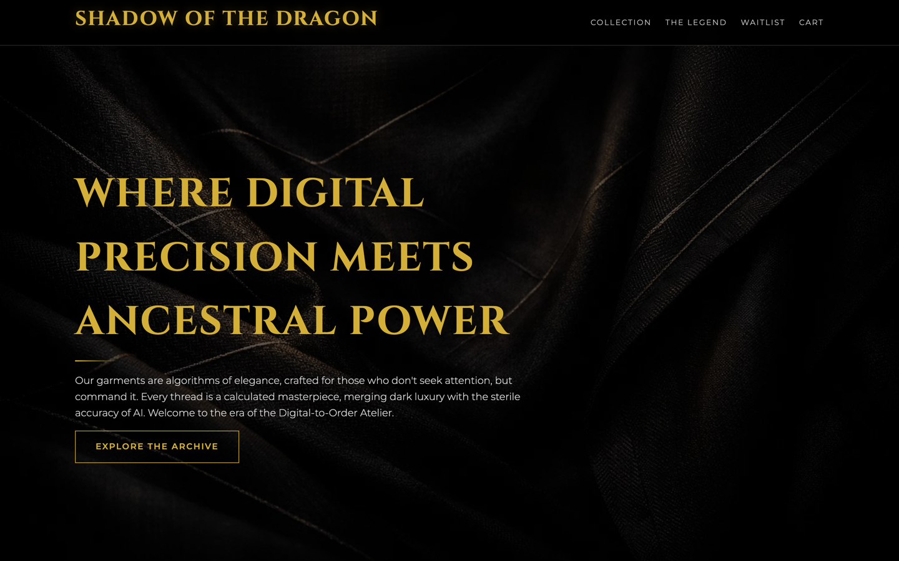
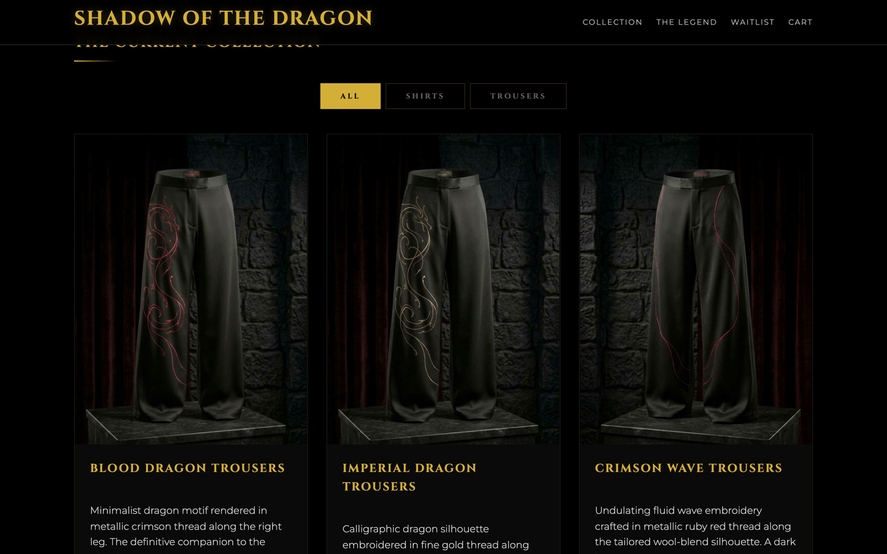
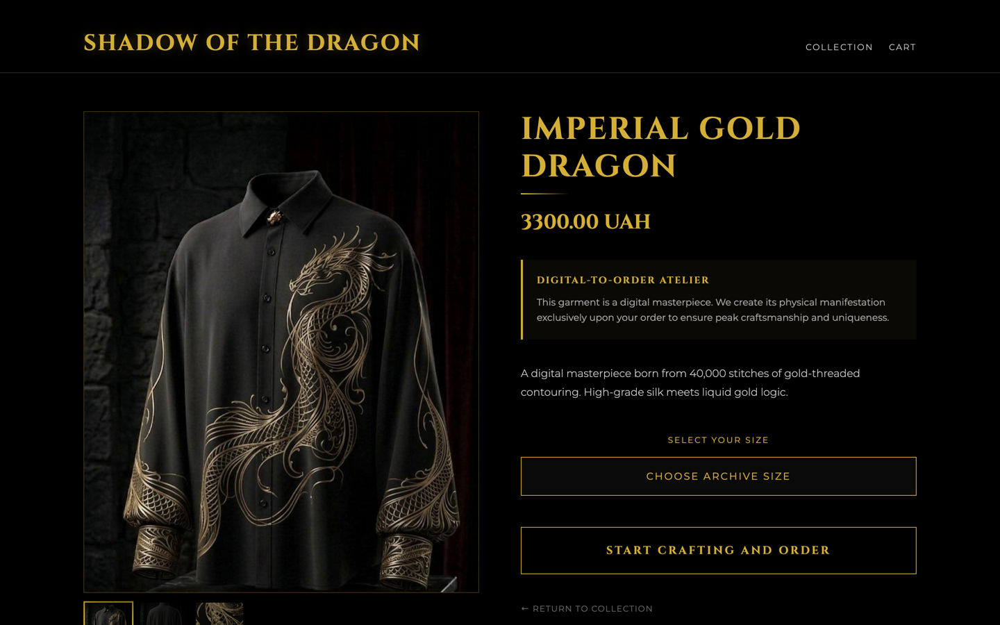
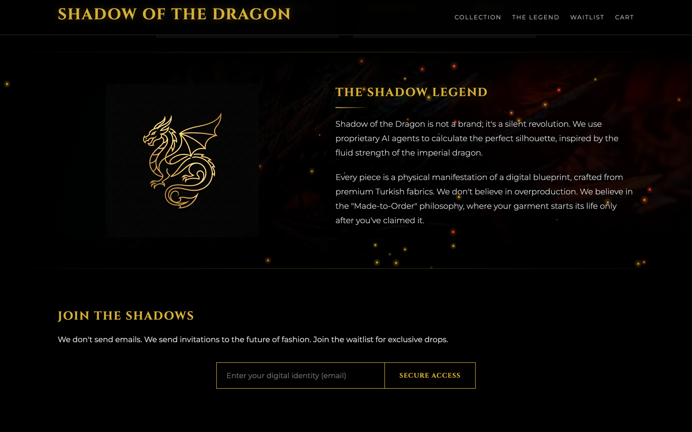
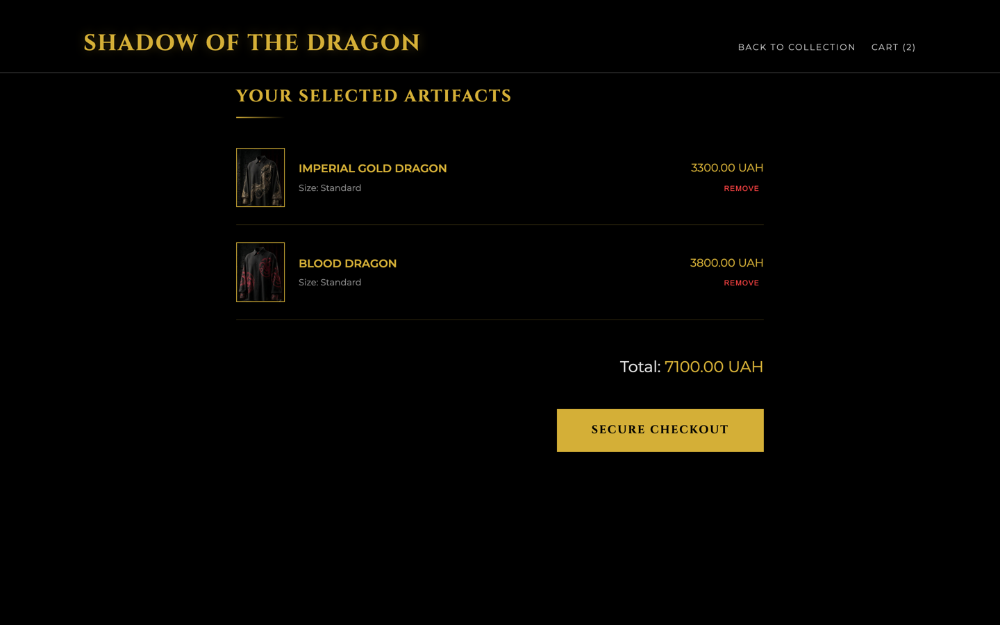
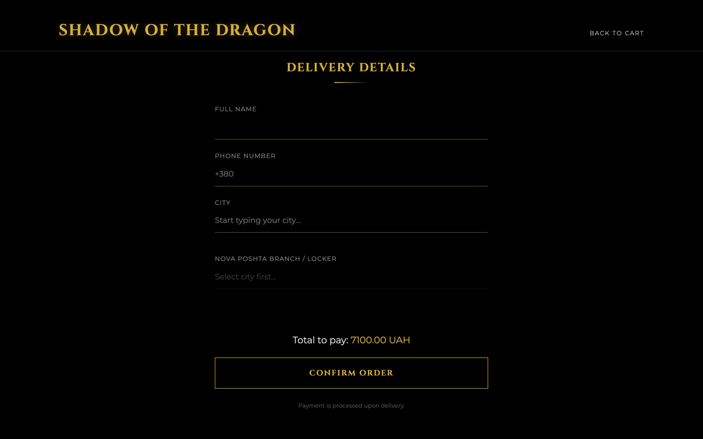
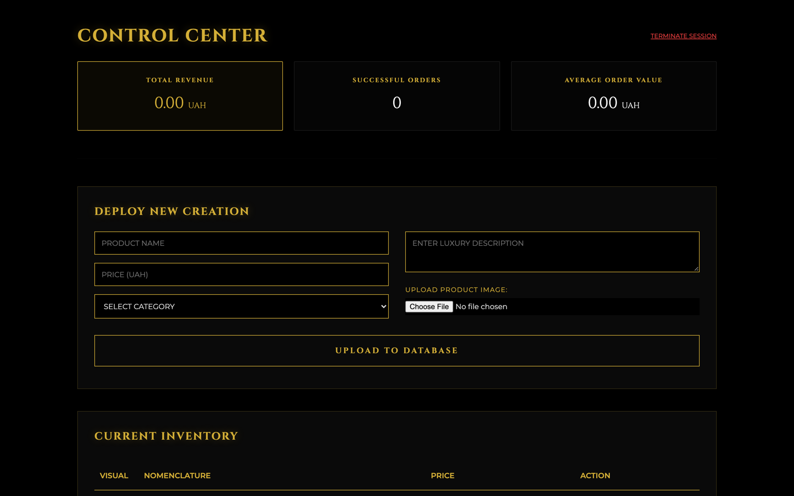
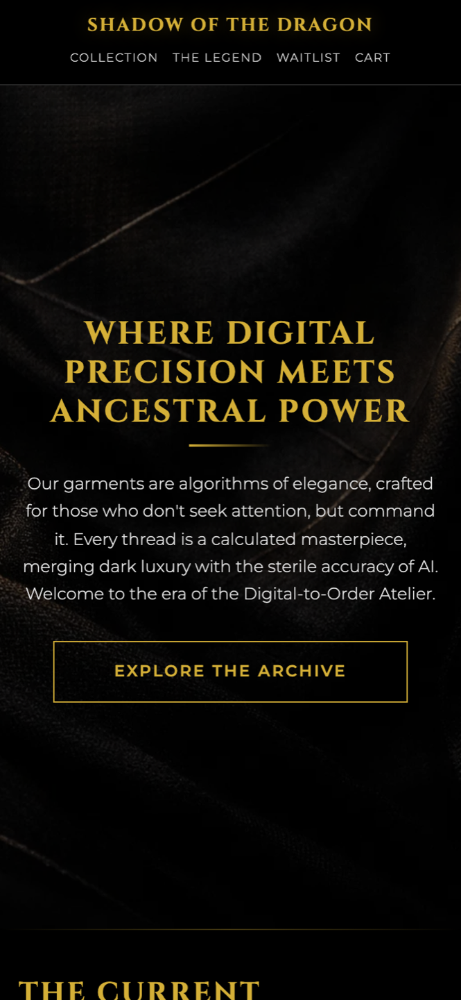
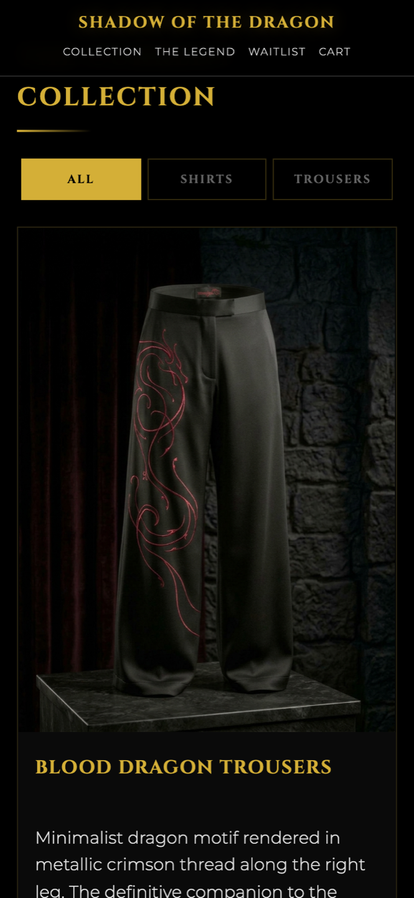
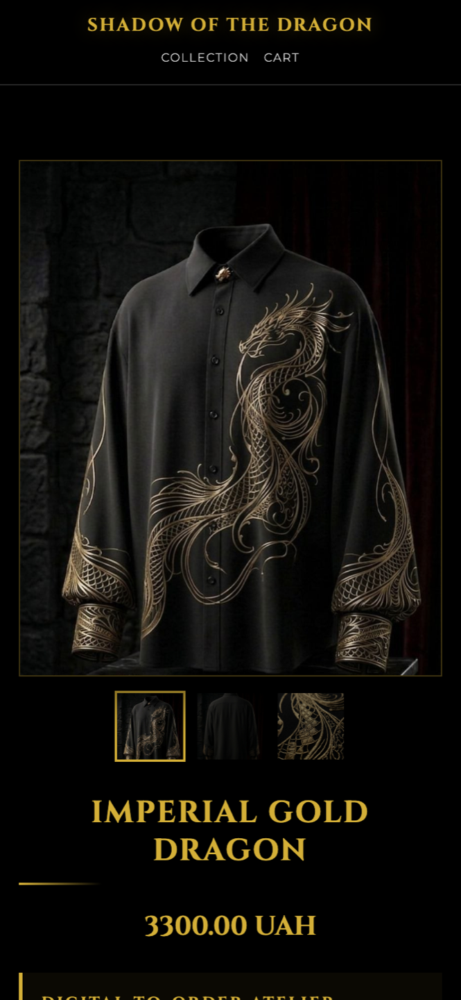

# Shadow of the Dragon

> A luxury digital-to-order menswear e-commerce platform built with Flask.

[](https://www.python.org/)
[](https://flask.palletsprojects.com/)
[](https://www.sqlite.org/)
[](https://www.sqlalchemy.org/)
[](https://golddragon.pythonanywhere.com)

---

## Overview

**Shadow of the Dragon** is a high-end menswear e-commerce platform designed with a contemporary digital-to-order atelier ethos. Rejecting fast-fashion overproduction, each garment is tailored on demand to eliminate deadstock and guarantee meticulous craftsmanship.

The platform couples a bespoke dark luxury visual identity—featuring gold accents, smooth scroll transitions via AOS.js, and a refined pairing of *Cinzel* and *Montserrat* typography—with a resilient, production-ready Flask architecture deployed on PythonAnywhere.

🔗 **Live Demo**: [golddragon.pythonanywhere.com](https://golddragon.pythonanywhere.com)

---

## Screenshots

### Hero & Landing Page
*Cinematic fullscreen hero with dark luxury aesthetic and gold Cinzel typography.*



### Product Catalog with Category Filters
*Interactive filter tabs (ALL / SHIRTS / TROUSERS) with animated product grid.*



### Product Detail & Gallery
*Two-column layout with interactive image gallery, size selector, and made-to-order badge.*



### The Shadow Legend
*Cinematic storytelling section with fire dragon background, CSS pulse animation, and canvas-driven floating ember particles.*



### Shopping Cart
*Session-based cart with product thumbnails, size info, and price breakdown.*



### Checkout with Nova Poshta
*Smart delivery form with city autocomplete and branch/locker search powered by Nova Poshta API.*



### Admin Dashboard
*Secure control center with revenue analytics, product CRUD, order management, and waitlist tracking.*



### Mobile Responsive
*Fully optimized for mobile devices with adaptive navigation, stacked layouts, and touch-friendly controls.*

<p align="center">
  
  
  
</p>

---

## Key Features

### E-Commerce Flow
- **End-to-End Shopping Experience**: Catalog → product detail with gallery → session-based cart → address-aware checkout → confirmation.
- **Made-to-Order Philosophy**: Sustainable digital-to-order production model with on-demand fulfillment, eliminating warehouse surplus.
- **Smart Logistics (Nova Poshta API)**: Real-time city autocomplete and dynamic branch / parcel locker search via Ukrainian postal service.
- **Category Filter Tabs**: Client-side instant filtering by ALL / SHIRTS / TROUSERS with smooth transitions.
- **Interactive Product Gallery**: Multi-image carousel with clickable thumbnails and full-size preview.

### Visual Design & Animations
- **Dark Luxury Aesthetic**: Pure black backgrounds, antique gold (`#d4af37`) accents, frosted glass navbar.
- **Dragon Fire Background**: Cinematic fire-breathing dragon image with CSS `dragonPulse` animation (breathing/pulsing effect).
- **Floating Ember Particles**: Canvas-based particle system with 50 fire-colored embers, sinusoidal wobble, and IntersectionObserver for performance.
- **AOS.js Scroll Animations**: Smooth entrance animations triggered on scroll.
- **Responsive Design**: Three breakpoints (920px tablet, 768px phone, 420px narrow) ensuring pixel-perfect layouts across all devices.

### Administrative Operations
- **Revenue Dashboard**: Real-time KPIs — total revenue, order count, average check value.
- **Product Catalog CRUD**: Add, view, and delete products with image upload.
- **Order Management**: Status tracking pipeline (NEW → WEAVING → SHIPPED → CANCELLED) with auto-submit dropdowns.
- **Waitlist & Lead Capture**: Email subscription engine for upcoming collection drops.
- **AJAX Operations**: Smooth inline deletion of orders and leads without page reload.

### Integrations & Infrastructure
- **Telegram Bot Notifications**: Instant alerts for new orders and waitlist signups with 3-second deduplication.
- **Nova Poshta API**: `getCities` + `getWarehouses` with debounced async requests and number-first regex filtering.
- **Server-Side Validation**: Input sanitization, form validation, and secure file handling via Werkzeug.
- **Duplicate Prevention**: Client-side submit locks + server-side timestamp gating (5s checkout, 3s subscribe).
- **Environment Isolation**: Secrets managed via `python-dotenv` (`.env` excluded from Git).

---

## Tech Stack

| Category | Technology | Purpose |
| :--- | :--- | :--- |
| **Backend** | Python 3.13 / Flask 3.1 | Application routing, controllers, session handling |
| **Database** | SQLite / Flask-SQLAlchemy | Relational data persistence |
| **Templating** | Jinja2 | Server-side page rendering with template inheritance |
| **Styling** | Custom CSS3 | Dark luxury design system, responsive layout |
| **Typography** | Google Fonts | *Cinzel* (serif headers) & *Montserrat* (sans-serif body) |
| **Animations** | AOS.js + Canvas API | Scroll animations + ember particle engine |
| **Messaging** | Telegram Bot API | Admin notifications for orders and leads |
| **Logistics** | Nova Poshta API | City autocomplete and branch/locker search |
| **Configuration** | python-dotenv | Environment variable management |
| **Hosting** | PythonAnywhere | Cloud deployment |

---

## Project Structure

```
dragon_store/
├── app.py                      # Main Flask application (routes, models, APIs)
├── requirements.txt            # Python dependencies
├── .env                        # Environment variables (excluded from Git)
├── .gitignore                  # Git ignore rules
├── docs/
│   └── screenshots/            # README screenshots
├── static/
│   ├── css/
│   │   └── style.css           # Design system & responsive styles (~750 lines)
│   ├── images/                 # Product images (30 files)
│   └── favicon.svg             # Custom dragon favicon
└── templates/
    ├── base.html               # Master layout (nav, fonts, shared assets)
    ├── index.html              # Hero, catalog, legend, waitlist
    ├── product_detail.html     # Product page with gallery & size selector
    ├── cart.html               # Shopping cart summary
    ├── checkout.html           # Delivery form with Nova Poshta integration
    ├── success.html            # Order/subscription confirmation
    ├── admin_login.html        # Admin authentication portal
    ├── admin.html              # Admin dashboard (CRUD, orders, analytics)
    └── 404.html                # Custom error page
```

---

## Getting Started

### 1. Clone the Repository
```bash
git clone https://github.com/gold-dragon11/dragon_store.git
cd dragon_store
```

### 2. Install Dependencies
```bash
python3 -m venv venv
source venv/bin/activate      # On Windows: venv\Scripts\activate
pip install -r requirements.txt
```

### 3. Configure Environment Variables
Create a `.env` file in the root directory:

```env
SECRET_KEY=your_secure_secret_key_here
ADMIN_PASSWORD=your_admin_panel_password
TELEGRAM_BOT_TOKEN=your_telegram_bot_token
TELEGRAM_CHAT_ID=your_telegram_chat_id
NOVA_POSHTA_API_KEY=your_nova_poshta_api_key
```

### 4. Run the Application
```bash
python app.py
```

### 5. Access the Platform
- **Storefront**: [http://localhost:5000](http://localhost:5000)
- **Admin Panel**: [http://localhost:5000/admin](http://localhost:5000/admin) — log in with your `ADMIN_PASSWORD`

> The database auto-seeds with 8 products (4 shirts + 4 trousers) on first launch when empty.

---

## Deployment (PythonAnywhere)

1. Push code to GitHub
2. On PythonAnywhere: `git clone` or `git pull`
3. Create virtualenv and `pip install -r requirements.txt`
4. Set environment variables in `.env`
5. Configure WSGI file to point to `app.py`
6. Note: Free tier requires proxy for outbound HTTP (Telegram API)

---

## Product Catalog

| # | Name | Category | Price (UAH) |
| :--- | :--- | :--- | ---: |
| 1 | Imperial Gold Dragon | Shirt | 3,300 |
| 2 | Minimalist Gold Thread | Shirt | 2,500 |
| 3 | Void Wave Trousers | Trousers | 3,000 |
| 4 | Blood Dragon | Shirt | 3,800 |
| 5 | Solar Tri-Dragon | Shirt | 3,800 |
| 6 | Crimson Wave Trousers | Trousers | 3,200 |
| 7 | Imperial Dragon Trousers | Trousers | 3,500 |
| 8 | Blood Dragon Trousers | Trousers | 3,500 |

Each product features multi-angle gallery images (front, back, macro detail).

---

## License

This project was created as a portfolio demonstration. All product imagery is AI-generated.
